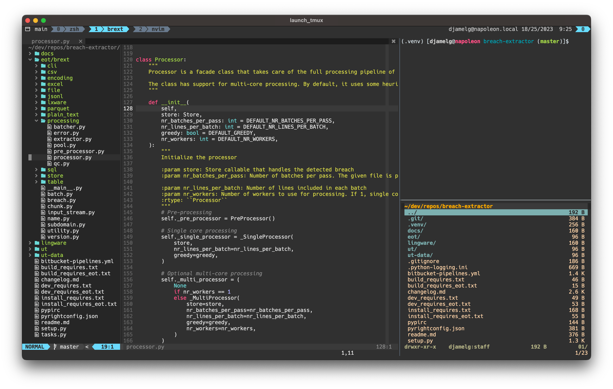

# Dotfiles

My personal development configuration files for:

* [alacritty](https://github.com/alacritty/alacritty) — Fast, cross-platform, OpenGL terminal emulator
* [git](https://git-scm.com) — Distributed version control system 
* [neovim](https://neovim.io) — Hyperextensible Vim-based text editor
* [tmux](https://github.com/tmux/tmux/wiki) — Terminal multiplexer
* [vifm](https://vifm.info) — File manager with curses interface providing a Vim-like environment 
* [zsh](https://zsh.sourceforge.io) — Shell designed for interactive use
* ...

The configurations are maintained using [Nix](https://nixos.org/) with [Home Manager](https://github.com/nix-community/home-manager) and are actively tested on Ubuntu (22.04 LTS, 23.04), 
Manjaro and macOS (Big Sur, Ventura), but should work on any other Linux or macOS system.



## Features

The configuration files provide a modern _terminal-only_ development environment
that is heavily focused on _vim-style_ navigation with minimal mouse usage.

* Alacritty

    * Support for _special keys_ on macOS so that key-bindings (e.g. `Alt`) work as expected

* Git

    * Neovim as default editor
    * Merges and diffs

        * GUI version using [Meld](https://meldmerge.org)
        * Console version using [icdiff](https://github.com/jeffkaufman/icdiff)

* Neovim

    * Lua-based configuration
    * Plugin management using [Packer](https://github.com/wbthomason/packer.nvim)

        * Bootstrapping of all plugins (installation upon first launch)

    * Code completion using [coc](https://github.com/neoclide/coc.nvim)
        
        * Install language support using, e.g. `:CocInstall coc-python coc-cmake coc-json`

* Tmux

    * `<C-a>` as prefix
    * Plugin management using [tpm](https://github.com/tmux-plugins/tpm)
    * Startup sessions are locally customizable 

* Vifm

    * Change current shell directory to navigated directory

* zsh

    * [oh-my-zsh](https://ohmyz.sh) based configuration
    * Vim-style editing
    * Improved navigation using [fzf](https://github.com/junegunn/fzf)

        * Optional preview using [bat](https://github.com/sharkdp/bat)
        * Directory switching with [zoxide](https://github.com/ajeetdsouza/zoxide)

    * Extensibility via `~/.zshrc_local`


## Dependencies

* [Git](https://git-scm.com) — Distributed version control system 
* [Home Manager](https://github.com/nix-community/home-manager) — Declarative configuration management using Nix
* [Nix](https://nixos.org/) — Package manager for declarative, reproducible builds

And of course the software related to the configuration packages of interest.

## Installation

```
git clone git@gitlab.com:dgrine/dotfiles.git ~/dotfiles
cd ~/dotfiles
./install-nix.sh
./install-home-manager.sh
```

The following program configurations are managed:

* [alacritty](https://github.com/alacritty/alacritty) — Fast, cross-platform OpenGL terminal emulator
* [bat](https://github.com/sharkdp/bat) — Cat clone with syntax highlighting and Git integration
* [coc](https://github.com/neoclide/coc.nvim) — Code completion server for Neovim

    * [coc-marketplace](https://github.com/fannheyward/coc-marketplace) — Marketplace for extensions
    * Extensions

        * [coc-cmake](https://github.com/voldikss/coc-cmake) — CMake
        * [coc-json](https://github.com/neoclide/coc-json) — JSON
        * [coc-prettier](https://github.com/neoclide/coc-prettier) — HTML
        * [coc-pyright](https://github.com/fannheyward/coc-pyright) — Python
        * [coc-texlab](https://github.com/fannheyward/coc-texlab)  — LaTeX
        * [coc-tsserver](https://github.com/neoclide/coc-tsserver) — TypeScript and JavaScript

* [exa](https://github.com/ogham/exa) — Modern replacement for `ls`
* [fzf](https://github.com/junegunn/fzf) — General-purpose command-line fuzzy finder
* [git](https://git-scm.com) — Distributed version control system 
* [icdiff](https://github.com/jeffkaufman/icdiff) — Command-line diff tool
* [meld](https://meldmerge.org) — Visual diff and merge tool
* [neovim](https://neovim.io) — Hyperextensible Vim-based text editor
* [ripgrep](https://github.com/BurntSushi/ripgrep) — Fast, line-oriented search tool for regex patterns
* [tldr](https://tldr.sh/) — Simplified and community-driven man pages
* [tmux](https://github.com/tmux/tmux/wiki) — Terminal multiplexer
* [vifm](https://vifm.info) — File manager with curses interface providing a Vim-like environment 
* [zoxide](https://github.com/ajeetdsouza/zoxide) — Smarter `cd` command
* [zsh](https://zsh.sourceforge.io) — Shell designed for interactive use

